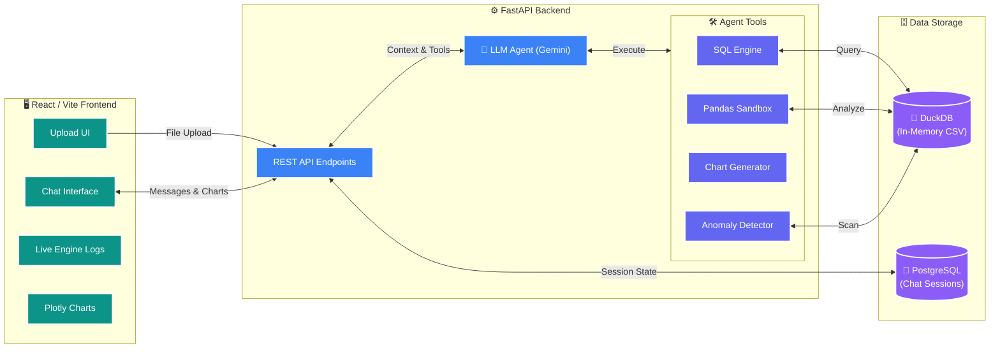

# Data Lens AI

A production-ready data analysis dashboard built with React (Vite), TailwindCSS, FastAPI, DuckDB, and PostgreSQL.

Data Lens AI allows you to instantly upload `.csv` datasets and chat with an AI Analyst. The AI can execute internal SQL and Pandas queries to analyze your data and dynamically render interactive Plotly charts right in the chat.

## Features
- **Instant Data Ingestion:** Upload `.csv` files and have them instantly registered into a blazing-fast local DuckDB instance.
- **Smart Schema Profiling:** The AI automatically scans your data upon upload to learn column types and basic statistics.
- **Agentic Analysis:** Ask questions in plain English. The AI dynamically generates and executes SQL or Pandas code on your dataset.
- **Interactive Visualizations:** The AI can generate Bar, Line, Scatter, and Pie charts. Charts are optimized for the sleek dark theme, featuring responsive heights, wrapped axis labels, and dynamic gradient coloring based on data values.
- **Live Engine Logs:** Watch the AI's internal tool usage (e.g. `RUN_SQL`, `RUN_PANDAS`) in real-time in a dedicated sliding right-panel.
- **Persistent Sessions:** All your chats and uploaded dataset metadata are saved across refreshes using PostgreSQL and browser `localStorage`.
- **Data Previews:** Click on any dataset in the sidebar to view a fully scrollable raw data grid.

## Tech Stack
- **Frontend:** React, Vite, Tailwind CSS, Plotly.js
- **Backend:** Python, FastAPI, DuckDB (for analytical queries), SQLAlchemy
- **Database:** PostgreSQL (for persisting chat sessions)
- **AI Integration:** Google Generative AI (`gemini-1.5-flash`)

## Prerequisites
- **Docker Desktop** must be running on your system.

## Environment Variables
Before running the app, ensure you have a valid `.env` file in the root `e:\assignment` directory containing:
```
GEMINI_API_KEY=your_api_key_here
```

## How to Run

1. Open your terminal in this directory (`e:\assignment`).
2. Make sure Docker Desktop is open and running.
3. Start all services by running:
   ```bash
   docker-compose up -d
   ```
4. Wait for the containers to start up.
5. Open your browser and navigate to:
   - **Frontend UI:** [http://localhost:5173](http://localhost:5173)
   - **Backend API Docs:** [http://localhost:8000/docs](http://localhost:8000/docs)

## How to use the app
1. Go to the Frontend UI (`http://localhost:5173`).
2. Click **Upload Dataset** in the left sidebar to upload a `.csv` file.
3. You can click on the dataset name in the sidebar to preview the raw data table.
4. Use the chat box at the bottom to ask analytical questions (e.g., "Show me a chart of the top 5 countries").

## Architecture & Code Structure




- `/frontend`: React application. `App.jsx` handles state, UI rendering, and layout. `index.css` contains custom glassmorphism styling and custom webkit scrollbars.
- `/backend/api`: FastAPI endpoints. Includes routers for `/chat`, `/upload`, `/sessions`, and `/datasets`.
- `/backend/services`: Core engine. `data_engine.py` handles DuckDB integration. `llm_agent.py` orchestrates the AI tool calling loop. `tools.py` defines the Python functions (SQL, Pandas, Charting) the AI can execute.

## Rebuilding
If you make any changes to the source code, the system supports hot-reloading (Vite & Uvicorn). However, if you need a fresh rebuild:
```bash
docker-compose up -d --build --force-recreate
```
